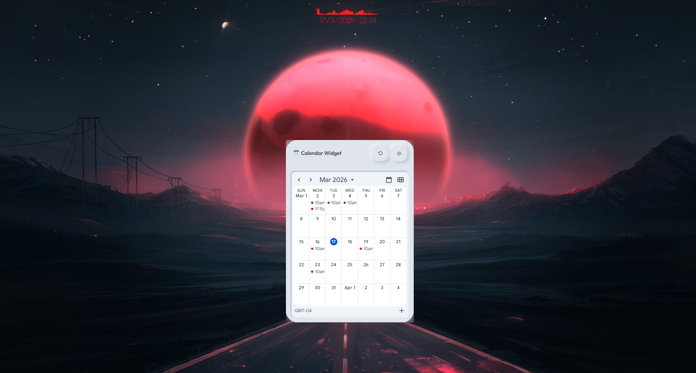
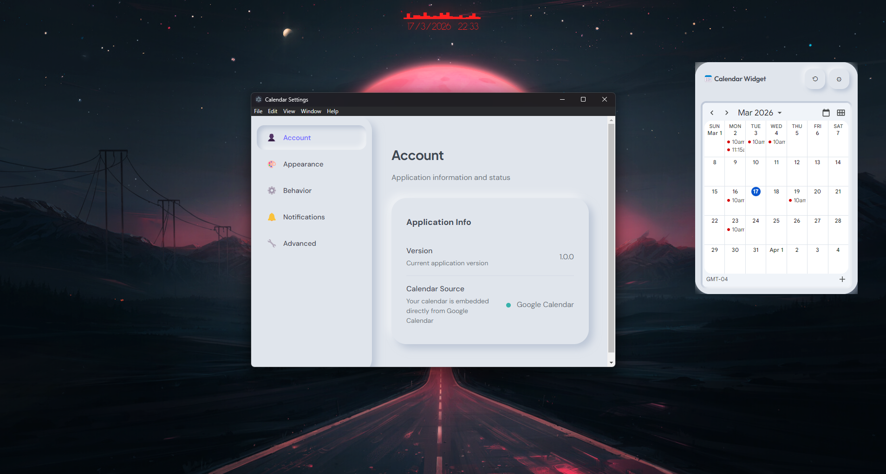

<h1 align="center">✨ ChronoDock ✨</h1>
<h3 align="center"><em>Your calendar that refuses to be forgotten</em></h3>

<p align="center">
  <strong>A floating desktop widget that lives on your screen—because out of sight is out of mind, and we're not taking any chances.</strong>
</p>

<p align="center">
  <a href="#-features"></a>
  <a href="#-quick-start"></a>
  <a href="#-license"></a>
</p>

<p align="center">
  
</p>

> **Note:** Replace `YOUR_USERNAME` in URLs with your GitHub username after forking.

---

## 🎯 What is ChronoDock?

**ChronoDock** is a frameless, always-on-top desktop calendar widget for Windows that embeds your Google Calendar directly on your desktop. Think of it as a friendly ghost that knows exactly what you're doing next—minus the haunting.

Built with Electron and a soft neumorphic design, ChronoDock floats above your workflow so you never miss a meeting, birthday, or that dentist appointment you've been rescheduling since 2023.

---

## ✨ Features

### Core Magic
| Feature | Description |
|---------|-------------|
| 📅 **Google Calendar** | Direct embed—your events, your calendars, zero sync headaches |
| 🪟 **Frameless & Floating** | Clean, borderless widget that stays on top |
| 📌 **Pin to Desktop** | Tuck it behind your desktop icons (Windows native API) |
| 🎨 **Neumorphic UI** | Soft, tactile design that feels like it's molded from clay |
| ⚙️ **Customizable** | Theme, opacity, click-through, time format—you name it |

### Settings at a Glance
- **Appearance**: Light/Dark/Auto theme, opacity control, always-on-top, click-through mode
- **Behavior**: Sync interval, event horizon, 12/24-hour time, weekend display
- **Notifications**: Desktop toasts, sound alerts, configurable reminder timing
- **Advanced**: Cache management, settings export, factory reset, DevTools

---

## 📸 Screenshots

<p align="center">
  
  
</p>

---

## 🚀 Quick Start

### Option A: Download (Easiest)

1. Grab the latest release from the [Releases](https://github.com/this-ved-dev/ChronoDock/releases) page
2. Run `Cally Setup x.x.x.exe` (installer) or `Cally x.x.x.exe` (portable)
3. Launch, click ⚙️, sign in with Google
4. Your calendar is now floating on your desktop 🎉

### Option B: Build from Source

```bash
# Clone the repo
git clone https://github.com/this-ved-dev/ChronoDock.git
cd ChronoDock

# Install & run
npm install
npm run build
npm start
```

### Google Calendar Setup

1. Go to [Google Cloud Console](https://console.cloud.google.com/)
2. Create a project → Enable **Google Calendar API**
3. Create **OAuth 2.0 credentials** (Desktop Application)
4. Create a `.env` file (copy from `.env.example`) and add your credentials:
   ```
   GOOGLE_CLIENT_ID=your_id.apps.googleusercontent.com
   GOOGLE_CLIENT_SECRET=your_secret
   ```

---

## 📖 Product Guide

### First Launch
1. **Launch ChronoDock** — The widget appears in the top-right (or last position)
2. **Click ⚙️** — Opens settings; sign in with Google if prompted
3. **Drag the header** — Reposition the widget anywhere on your screen
4. **⟲ Refresh** — Manually reload your calendar

### Widget Controls
| Control | Action |
|---------|--------|
| **Header drag** | Move the widget |
| **⟲** | Refresh calendar |
| **⚙️** | Open settings |
| **System tray** | Right-click for Show/Settings/Quit |

### Pin to Desktop
Enable "Pin to Desktop" in Settings → Appearance → Window. The widget becomes part of your desktop background, visible behind icons. Desktop icons remain fully clickable.

---

## 🛠 Technical Documentation

For a deeper technical dive (architecture, IPC, security model, extending ChronoDock), see [docs/TECHNICAL.md](docs/TECHNICAL.md).

### Architecture

```
┌─────────────────────────────────────────────────────────────┐
│                     Main Process (Node.js)                  │
│  ┌─────────────┐ ┌─────────────┐ ┌───────────────────────── │
│  │ Window      │ │ Auth        │ │ Calendar / Sync /        │
│  │ Manager     │ │ Manager     │ │ Notifications            │
│  └─────────────┘ └─────────────┘ └───────────────────────── │
└─────────────────────────────────────────────────────────────┘
         │                    │                    │
         ▼                    ▼                    ▼
┌─────────────────┐  ┌─────────────────┐  ┌─────────────────┐
│ Widget Renderer │  │ Settings        │  │ Native Addon    │
│ (iframe embed)  │  │ Renderer        │  │ (pin-to-desktop)│
└─────────────────┘  └─────────────────┘  └─────────────────┘
```

### Project Structure

```
cally/
├── src/
│   ├── main/           # Electron main process
│   │   ├── main.ts     # App entry, IPC handlers
│   │   └── window-manager.ts
│   ├── renderer/
│   │   ├── widget/     # Calendar widget UI
│   │   └── settings/   # Settings window UI
│   ├── shared/         # Preload, types, design tokens
│   ├── auth/           # Google OAuth
│   ├── calendar/       # Calendar API & sync
│   ├── database/       # SQLite (future offline cache)
│   └── notifications/  # Windows toast notifications
├── native/             # C++ addon for desktop pinning
└── assets/             # Icons, screenshots
```

### Security Model

- **Context Isolation**: Enabled — renderer cannot access Node.js directly
- **Node Integration**: Disabled — no `require()` in renderer
- **Preload Script**: Uses `contextBridge` to expose a minimal, whitelisted API
- **IPC**: All channels validated; no arbitrary `ipcRenderer.send`

### Scripts

| Command | Description |
|---------|-------------|
| `npm run dev` | Development mode with hot reload |
| `npm run build` | Build TypeScript + Webpack |
| `npm start` | Run built app |
| `npm run dist` | Build installer + portable exe |
| `npm run lint` | Run ESLint |

---

## 🏷 GitHub Topics

When you push to GitHub, add these topics to your repo for discoverability:

```
electron
desktop-app
calendar
google-calendar
widget
windows
neumorphism
productivity
open-source
typescript
```

---

## 🤝 Contributing

We love contributions! See [CONTRIBUTING.md](CONTRIBUTING.md) for guidelines.

1. Fork the repo
2. Create a feature branch (`git checkout -b feature/amazing-feature`)
3. Commit your changes (`git commit -m 'Add amazing feature'`)
4. Push to the branch (`git push origin feature/amazing-feature`)
5. Open a Pull Request

---

## 📋 Requirements

- **Windows 10/11**
- **Node.js 18+** (for development)
- **Visual Studio Build Tools** (for native addon, if building from source)
- **Google Calendar API** credentials

---

## 🐛 Troubleshooting

| Issue | Solution |
|-------|----------|
| Calendar not loading | Sign in via Settings ⚙️; check OAuth credentials |
| Pin to desktop not working | Requires Windows 10/11; may not work in VMs |
| Build fails (native addon) | Install VS Build Tools; run `npm rebuild` |
| Symlink errors during `npm run dist` | Run as Administrator or enable Developer Mode |

---

## 📜 License

MIT License — see [LICENSE](LICENSE) for details.

---

<p align="center">
  <strong>Made with ☕ and a mild obsession with never missing meetings</strong>
</p>
<p align="center">
  <sub>If you find ChronoDock useful, consider giving it a ⭐</sub>
</p>
